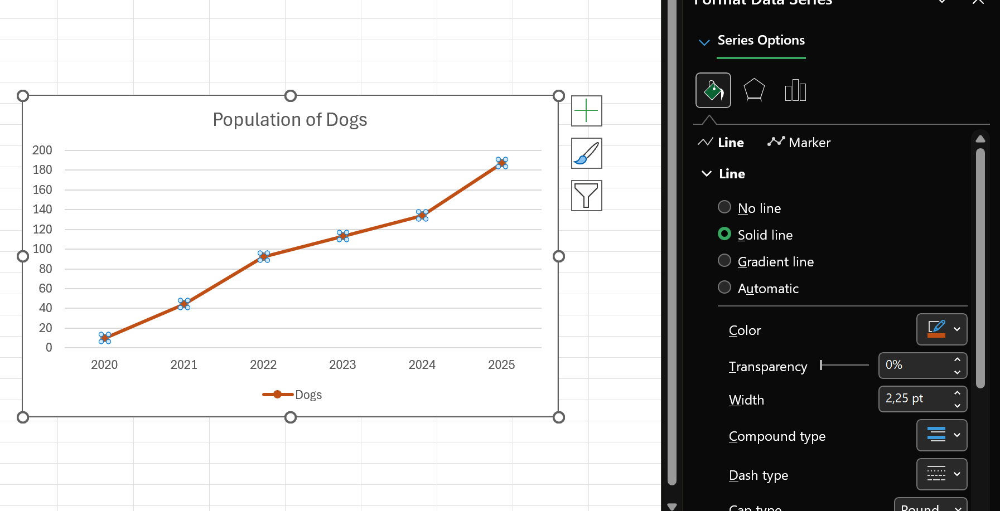

# 📊 Excel-16

## ✨ Project Description

**Excel-16** is a guide to creating and customizing Charts in Microsoft Excel.  
Find clear explanations, practical examples, and lots of screenshots for charts, sparklines, combination charts, Gantt charts, and thermometer charts.

> 📚 **Goal:** Help you visualize data in Excel—step-by-step instructions for beginners and advanced users!

---

## 📒 Table of Contents

- [Line Chart](#-line-chart)
- [Change Chart Type](#-change-chart-type)
- [Switch Row/Column](#-switch-rowcolumn)
- [Legend Position & Data Labels](#-legend-position--data-labels)
- [Column Chart](#-column-chart)
- [Pie Chart](#-pie-chart)
- [Bar Chart](#-bar-chart)
- [Area Chart](#-area-chart)
- [Scatter Plot](#-scatter-plot)
- [Sparklines](#-sparklines)
- [Combination Chart](#-combination-chart)
- [Thermometer Chart](#-thermometer-chart)
- [Gantt Chart](#-gantt-chart)
- [Screenshots](#-screenshots)
- [Requirements](#-requirements)
- [Author](#-author)

---

## 📈 Line Chart

To create a line chart:
1. Select the range A1:D7.
2. Go to **Insert > Charts > Line**.
3. Choose *Line with Markers*.

Result:

> 📝 **Tip:** Click Chart Title to add a title.

---

## 🔄 Change Chart Type

1. Select the chart.
2. Go to **Chart Design > Type > Change Chart Type**.
3. Choose *Column*.

Result:

---

## ↕️ Switch Row/Column

1. Select the chart.
2. Go to **Chart Design > Data > Switch Row/Column**.

Result:

---

## 🏷️ Legend Position & Data Labels

1. Select the chart.
2. Click the **+** button, open Legend options, select *Right*.

3. Select the Jun data series (green bar).
4. Hold CTRL, use arrows to select *Cats in June*.
5. Click the **+** button, check *Data Labels*.

Result:

> 📝 **Tip:** You can change the Chart Title for clarity.

---

## 📊 Column Chart

1. Select range A1:A7, hold CTRL, select C1:D7.
2. Go to **Insert > Charts > Column > Clustered Column**.

Result:

> ℹ️ If you have numeric labels, empty cell A1 before creating the chart. Enter text "Year" after.

---

## 📈 Another Line Chart Example

1. Select A1:D7.
2. Go to **Insert > Charts > Line > Line with Markers**.

To change the data range:
- Select the chart > Chart Design > Data > Select Data.
- Uncheck *Cats* and *Hamsters*, click OK.

Result:

To change line/marker color:
- Right-click the line, choose *Format Data Series* > paint bucket.

To add a trendline:
- Click **+** > Trendline > More Options > Linear.
- Forecast: type `2` in Forward.

To use Date axis:
- Right-click axis > Format Axis > Date axis.

---

## 🥧 Pie Chart

1. Select A1:D2.
2. Go to **Insert > Charts > Pie**.

Result:

> 📝 **Tip:** Click a slice to drag it from center.

Another example:
- Select A1:D1 and A3:D3 (CTRL).
- Create pie chart, delete legend, add data labels, change colors.

Result:

- Right-click chart > Format Data Labels.
- Check Category Name, Percentage; Center.

Result:

> 📝 Change font size and color via right-click.

---

## 📊 Bar Chart

A bar chart is a horizontal column chart, best for large text labels.

1. Select your range.
2. Go to **Insert > Charts > Column > Clustered Bar**.

Result:

---

## 🗻 Area Chart

Shows contribution over time.

1. Select range.
2. Go to **Insert > Charts > Line > Area**.

Result:

Change to *Stacked Area* for overlapping display.

---

## 🌐 Scatter Plot

Used to see relationships between variables X & Y.

**Only Markers:**
1. Select range.
2. Go to **Insert > Charts > Scatter > Scatter**.

Result:

You can add a trendline for clarity.

**Error Bars:**
1. Select chart.
2. Click **+** > Error Bars > More Options.
3. Choose Direction: *Both*. End Style: *Cap*.

- Enter a fixed value, e.g., 10.
- Remove horizontal error bars if needed.

Result:

> ℹ️ Custom error bars are possible.

---

## 📉 Sparklines

Tiny in-cell charts for trends. Types: Line, Column, Win/Loss.

To create:
1. Select cells for sparklines.
2. Go to **Insert > Sparklines > Line**.
3. Select data range, click OK.

Result:

> 📝 Sparklines update automatically when values change.

**Customize:**
1. Select sparklines.
2. Go to **Sparkline > Show**: check High/Low Point.
3. Change row height/column width to resize.
4. Go to **Sparkline > Style** for visual style.

**Sparkline Types:**
- Switch between Line, Column, Win/Loss.

> ℹ️ Win/Loss shows only if value is positive or negative.

---

## 🧩 Combination Chart

Combines two or more chart types.

1. Select range.
2. Go to **Insert > Charts > Combo > Create Custom Combo Chart**.
3. Choose *Clustered Column* for Rainy Days, *Line* for Profit.
4. Plot Profit on secondary axis.

Click OK.

---

## 🌡️ Thermometer Chart

Shows progress toward a goal.

1. Select cell B16.
2. Go to **Insert > Charts > Column > Clustered Column**.

Result:

- Remove chart title and horizontal axis.
- Right-click blue bar, set Gap Width to 0%.
- Adjust chart width.
- Right-click percentages, Format Axis: min 0, max 1, Major ticks Outside.

Result:

---

## 🗓️ Gantt Chart

Excel does not offer Gantt by default, but you can create one using a stacked bar chart.

1. Select range.
2. Go to **Insert > Charts > Column > Stacked Bar**.

Result:

- Delete legend.
- Right-click tasks on chart, Format Axis: Categories in reverse order.

- Right-click blue bars, Format Data Series: Fill > No fill.
- Dates/times stored as numbers (e.g., 1-Jun-2023 is 45078).

Result:

---

## 📷 Screenshots

All screenshots are located in the `/Screenshots` folder.

---

## ℹ️ Requirements

- Microsoft Excel (recommended: 2021/365 for all chart features)
- Windows OS (for best compatibility)

---

## 👨‍💻 Author

Project and documentation by **Kuba27x**  
Repository: [Kuba27x/Excel-16](https://github.com/Kuba27x/Excel-16)

---
