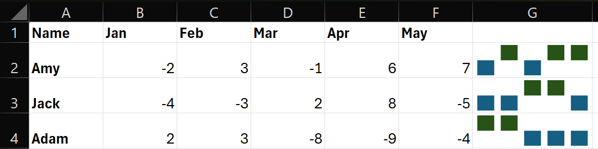
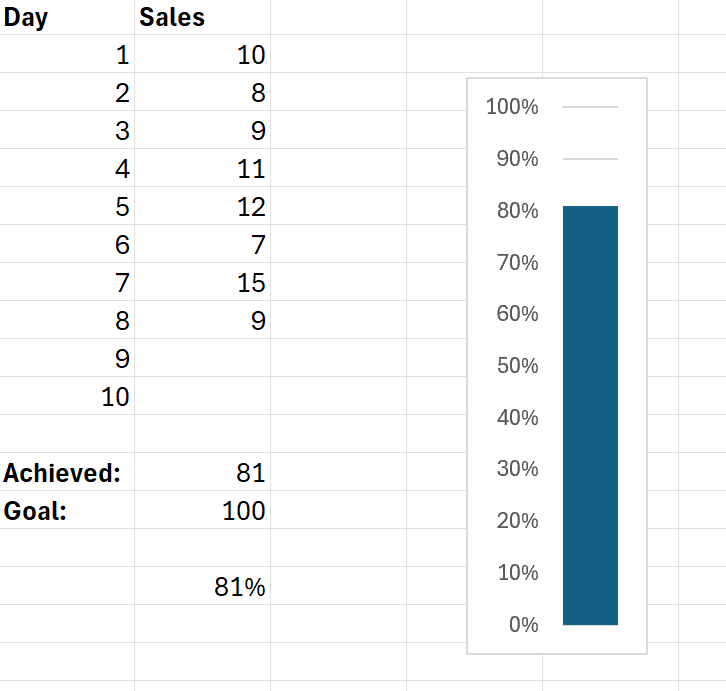

Excel-16

Project Description

Excel-16 is a guide to Charts in Microsoft Excel. This repository provides clear explanations, practical examples, and screenshots for many charts, sparklines and more.

Table of Contents

Charts

To create a line chart, execute the following steps.

1. Select the range A1:D7.
2. On the Insert tab, in the Charts group, click the Line symbol.
3. Click Line with Markers.

Result:

(Note: You can enter a title by clicking on Chart Title.)

Change Chart Type

1. Select the chart.
2. On the Chart Design tab, in the Type group, click Change Chart Type.
3. On the left side, click Column then click OK.

Result:

Switch Row/Column

1. Select the chart.
2. On the Chart Design tab, in the Data group, click Switch Row/Column.

Result:

Legend Position and Data Labels

1. Select the chart.
2. Click the + button on the right side of the chart, click the arrow next to Legend and click Right.

3. Click a green bar to select the Jun data series.
4. Hold down CTRL and use your arrow keys to select the population of Cats in June (tiny green bar).
5. Click the + button on the right side of the chart and click the check box next to Data Labels.

Result:

(Note: I also changed the Chart Title.)

Column Chart

1. Select the range A1:A7, hold down CTRL, and select the range C1:D7.
2. On the Insert tab, in the Charts group, click the Column symbol.
3. Click Clustered Column.

Result:

(Note: Note: only if you have numeric labels, empty cell A1 before you create the column chart. By doing this, Excel does not recognize the numbers in column A as a data series and automatically places these numbers on the horizontal (category) axis. 
After creating the chart, you can enter the text Year into cell A1 if you like.)

Line Chart

1. Select the range A1:D7.
2. On the Insert tab, in the Charts group, click the Line symbol.
3. Click Line with Markers.

To change the data range included in the chart, execute the following steps.

4. Select the line chart.
5. On the Chart Design tab, in the Data group, click Select Data.
6. Uncheck Cats and Hamsters and click OK.

Result:

To change the color of the line and the markers, execute the following steps.

7. Right click the line and click Format Data Series.
8. Click the paint bucket icon and change the line color.
9. Click Marker and change the fill color and border color of the markers.

To add a trendline, execute the following steps.

10. Select the line chart.
11. Click the + button on the right side of the chart, click the arrow next to Trendline and then click More Options.
12. Choose a Trend/Regression type. Click Linear.
13. Specify the number of periods to include in the forecast. Type 2 in the Forward box.

To change the axis type to Date axis, execute the following steps.

14. Right click the horizontal axis, and then click Format Axis.
15. Click Date axis.

Pie Chart

1. Select the range A1:D2.
2. On the Insert tab, in the Charts group, click the Pie symbol.
3. Click Pie.

Result:

(Note: Click on the pie to select the whole pie. Click on a slice to drag it away from the center.)

Another example

4. Select the range A1:D1, hold down CTRL and select the range A3:D3.
5. Create the pie chart
6. Click the legend at the bottom and press Delete.
7. Click the + button on the right side of the chart and click the check box next to Data Labels.
9. Click the paintbrush icon on the right side of the chart and change the color scheme of the pie chart.

Result:

9. Right click the pie chart and click Format Data Labels.
10. Check Category Name, uncheck Value, check Percentage and click Center.

Result:

(Note: Right click the data labels and click Font to change the font size and font color of the data labels.)

Bar Chart

A bar chart is the horizontal version of a column chart. Use a bar chart if you have large text labels.

1. Select the range
2. On the Insert tab, in the Charts group, click the Column symbol.
3. Click Clustered Bar.

Result:

Area Chart

Use a stacked area chart to display the contribution of each value to a total over time.

1. Select the range
2. On the Insert tab, in the Charts group, click the Line symbol.
3. Click Area.

Result: in this example, some areas overlap.

Change the chart's subtype to Stacked Area.

Result:

Scatter Plot

Scatter plots are often used to find out if there's a relationship between variables X and Y.

Only Markers

1. Select the range
2. On the Insert tab, in the Charts group, click the Scatter symbol.
3. Click Scatter.

Result:

(Note: We added a trendline to clearly see the relationship between these two variables.)

Error Bars

1. Select the chart.
2. Click the + button on the right side of the chart, click the arrow next to Error Bars and then click More Options.

Notice the shortcuts to add error bars using the Standard Error, a percentage value of 5%, or 1 standard deviation.

3. Choose a Direction. Click Both.
4. Choose an End Style. Click Cap.

5. For example, click Fixed value and enter the value 10.
6. If you add error bars to a scatter plot, Excel also adds horizontal error bars. To remove the horizontal error bars, select them and press Delete.

Result:

(Note: It is possible to add custom error bars.)

Sparklines

Sparklines in Excel are graphs that fit in one cell. Sparklines are great for displaying trends. Excel offers three sparkline types: Line, Column and Win/Loss.

To create sparklines, execute the following steps.

1. Select the cells where you want the sparklines to appear.
2. On the Insert tab, in the Sparklines group, click Line.
3. Click in the Data Range box and select the range
4. Click OK.

Result:

(Note: If u change values Excel automatically updates the sparkline.)

Customize Sparklines

1. Select the sparklines.
2. On the Sparkline tab, in the Show group, check High Point and Low Point.

(Note: to make the sparklines larger, simply change the row height and column width of the sparkline cells.)

3. On the Sparkline tab, in the Style group, choose a nice visual style.

Result:

Sparkline Types

1. Select the Line sparklines.
2. On the Sparkline tab, in the Type group, click Column.

Result:

3. Select the column sparklines.
4. On the Sparkline tab, in the Type group, click Win/Loss.
5. On the Sparkline tab, in the Show group, uncheck High Point and Low Point and check Negative Points.

Result:

(Note: we changed the data to negative and positive values. A win/loss sparkline only shows whether each value is positive (win) or negative (loss).)

Combination Chart

A combination chart is a chart that combines two or more chart types in a single chart.

To create a combination chart, execute the following steps.

1. Select the range
2. On the Insert tab, in the Charts group, click the Combo symbol.
3. Click Create Custom Combo Chart.
4. For the Rainy Days series, choose Clustered Column as the chart type.
5. For the Profit series, choose Line as the chart type.
6. Plot the Profit series on the secondary axis.

7. Click OK.

Thermometer Chart

A thermometer chart shows you how much of a goal has been achieved.

1. Select cell B16.
2. On the Insert tab, in the Charts group, click the Column symbol.
3. Click Clustered Column.

Result:

4. Remove the chart tile and the horizontal axis.
5. Right click the blue bar, click Format Data Series and change the Gap Width to 0%.
6. Change the width of the chart.
7. Right click the percentages on the chart, click Format Axis, fix the minimum bound to 0, the maximum bound to 1 and set the Major tick mark type to Outside.

Result:

Gantt Chart

Excel does not offer Gantt as a chart type, but it's easy to create a Gantt chart by customizing the stacked bar chart type. 

1. Select the range
2. On the Insert tab, in the Charts group, click the Column symbol.
3. Click Stacked Bar.

Result:

4. Click the legend at the bottom and press Delete.
5. The tasks (Foundation, Walls, etc.) are in reverse order. Right click the tasks on the chart, click Format Axis and check 'Categories in reverse order'.

6. Right click the blue bars, click Format Data Series, Fill & Line icon, Fill, No fill.
7. Dates and times are stored as numbers in Excel and count the number of days since January 0, 1900. 1-jun-2023 (start) is the same as 45078. 15-jul-2023 (end) is the same as 45122. Right click the dates on the chart, click Format Axis and fix the minimum bound to 45078, maximum bound to 45122 and Major unit to 7.

Result:

